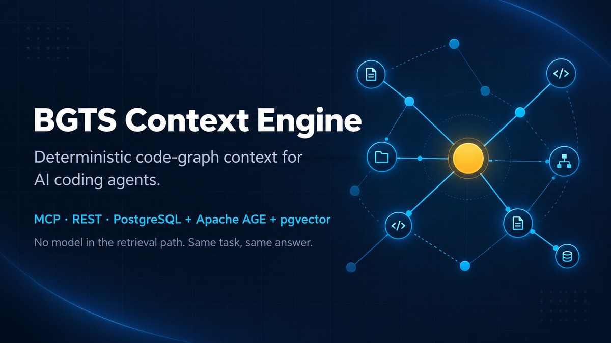

# BGTS Context Engine — Microsite



**Deterministic code-graph context for AI coding agents.** This repository hosts the
single-file, self-contained landing page for the
[BGTS Context Engine (BCE)](https://github.com/bgts-ai-org/bgts-context-engine) — an
open-source, MIT-licensed engine that maps repositories into a deterministic code graph and
serves the symbols, relationships and evidence AI agents need, over MCP and REST, on
PostgreSQL with Apache AGE and pgvector.

> **No model in the retrieval path. Same task, same answer.**

The page's **Evidence** section publishes four measurement runs interactively — two 40-pull-request
retrieval replays (against `voyage-code-4` and `jina-code-embeddings-1.5b`) and two agent A/B
studies (Cursor with `grok-4.6`, and Claude `opus-5`) — including every result where the engine
lost.

[](https://bgts.com/bce/)
[](https://github.com/bgts-ai-org/bgts-context-engine)
[](https://github.com/bgts-ai-org/bgts-context-engine/blob/main/LICENSE)
[](https://github.com/bgts-ai-org/bgts-context-engine)
[](https://github.com/bgts-ai-org/bgts-context-engine)

## Table of contents

- [About](#about)
- [Live site](#live-site)
- [Files](#files)
- [Contact form](#contact-form)
- [SEO and structured data](#seo-and-structured-data)
- [Before publishing](#before-publishing)
- [Related links](#related-links)
- [License](#license)

## About

BCE indexes a codebase into a queryable, deterministic code graph — no embeddings, no
approximation — so AI coding agents get exact symbols, call graphs and evidence instead of
guessing from vector similarity. This microsite is the product's landing page: one
`index.html`, no build step, no framework and **no third-party runtime request at all** —
fonts and three.js are self-hosted under `assets/`.

Topics covered on the page and in this repository: `ai-agents` · `apache-age` ·
`code-graph` · `code-search` · `codebase-indexing` · `context-engineering` ·
`deterministic` · `deterministic-ai` · `developer-tools` · `llm` · `mcp` · `mcp-server` ·
`pgvector` · `postgresql` · `rag` · `static-analysis` · `tree-sitter`

## Live site

🔗 **https://bgts.com/bce/** *(placeholder origin — see [Before publishing](#before-publishing))*

Each language has its own indexable, shareable URL:

| Language | URL |
| --- | --- |
| English (default) | `https://bgts.com/bce/?lang=en` |
| Türkçe | `https://bgts.com/bce/?lang=tr` |

The choice persists per browser in `localStorage` and is declared to crawlers via
`hreflang` (`en`, `tr`, `x-default`).

## Files

| File | Purpose |
| --- | --- |
| `index.html` | The site. Complete `<head>`, inline CSS and JS; media and the renderer live in `assets/`. |
| `assets/` | Extracted media (six UI screenshots, the walkthrough MP4 and its poster, the social card), the self-hosted fonts, the vendored three.js build, and `hero-gl.js`. `MANIFEST.json` and the two `PROVENANCE.json` files record the origin and sha256 of everything vendored. |
| `tools/` | One-off, zero-dependency Node scripts that produced the above. Committed for reproducibility; none of them runs at serve time. |
| `serve.js` | Server. Static files (correct MIME types, byte-range support for the video) plus `POST /api/contact`, which sends the contact form via the Gmail API. |
| `lib/gmail.js` | Zero-dependency Gmail API sender (OAuth2 refresh-token flow) used by `serve.js`. |
| `.env` | Gmail OAuth2 credentials for the contact form. Not committed — see [Contact form](#contact-form). |
| `robots.txt` | Allow-all plus the sitemap pointer. |
| `sitemap.xml` | One URL with `hreflang` alternates for `en`, `tr` and `x-default`. |
| `og-image.jpg` | The 1200×675 Open Graph / Twitter card image. |
| `BCE_SEO.md` | Full inventory of what the page emits for search engines and social platforms. |
| `BCE_RESEARCH.md` | Source research backing the product claims on the page. |
| `BCE_CONTENT_SOURCE_MAP.md` | Maps every on-page claim to its source. |

## Contact form

The contact form on the page (`#contact-form`) submits via `fetch` to `POST /api/contact`,
handled by `serve.js`, which sends the message through the Gmail API — no `mailto:` link
and no client-side credentials. This means the site now needs a Node host for that endpoint
to work (static-only hosting will serve the page but the form will fail).

Required environment variables, in a `.env` file at the repository root (gitignored):

```
GMAIL_CLIENT_ID=...
GMAIL_CLIENT_SECRET=...
GMAIL_REFRESH_TOKEN=...
GMAIL_USER=bgtsweb@gmail.com
CONTACT_TO=opensource-ai@bgts.com
```

`GMAIL_REFRESH_TOKEN` must come from an OAuth2 consent flow authorized for `GMAIL_USER`;
if the Gmail API starts returning `invalid_grant`, the token has expired or been revoked
and needs to be reissued.

## SEO and structured data

- **Metadata**: language-specific `<title>` and `description`, `keywords` sourced from the
  repository's own topics, `canonical`, full `hreflang` set, Open Graph and Twitter card tags,
  `theme-color`, and an inline SVG favicon — all re-emitted on language switch.
- **JSON-LD**: `SoftwareApplication`, `SoftwareSourceCode`, `Organization` and an
  eight-question `FAQPage`, regenerated per language. Every claim in the structured data is
  also stated on the page itself.
- **On-page**: exactly one `h1`, every section wired to an `h2` via `aria-labelledby`,
  descriptive `alt` text on every image, semantic `nav`/`main`/`section`/`figure`/`table`
  markup, no text baked into images, no horizontal scroll from 320px up, and no
  layout-shift animations — all Core Web Vitals inputs.
- **Performance**: `index.html` is ~410 KB, down from 3.1 MB — the screenshots and the 1.7 MB
  walkthrough were base64 data URIs and are now real files, lazy-loaded. The three font families
  are self-hosted (latin + latin-ext, 238 KB, SIL OFL), so the page makes no cross-origin request
  on the critical path — or on any path. The WebGL hero is never fetched before `load`, and not at all on a phone, a
  metered connection, a low-memory device, a software rasteriser, or with reduced motion set.

See [`BCE_SEO.md`](./BCE_SEO.md) for the complete breakdown.

## Before publishing

| Item | Action |
| --- | --- |
| Repository visibility | Make `bgts-ai-org/bgts-context-engine` public, or repoint the ~10 links on the page (including the primary CTA) that reference it. |
| Canonical host | Replace `https://bgts.com/bce/` in `index.html` (`canonical`, `hreflang`, sitemap references), `robots.txt` and `sitemap.xml` with the real production origin. |
| Open Graph image | Currently references the product's official social preview; confirm it resolves from the production origin before launch. |
| Benchmark figures | The "Evidence" section publishes four internal measurement runs: dollar totals and per-task deltas, 40 pull requests referenced by number, a target repository name and commit, serving details, and third-party model and CLI build strings. Confirm all of it is cleared for public release — see §16 of `BCE_CONTENT_SOURCE_MAP.md`. |
| Analytics | None is included by default. Add it deliberately and keep any KVKK/GDPR notice consistent with what it collects. |
| Contact form hosting | Requires running `serve.js` (or equivalent) with the `.env` Gmail credentials — see [Contact form](#contact-form). Static-only hosting breaks the form. |

## Related links

- [BGTS Context Engine — source repository](https://github.com/bgts-ai-org/bgts-context-engine)
- [Documentation](https://github.com/bgts-ai-org/bgts-context-engine/tree/main/docs)
- [Changelog](https://github.com/bgts-ai-org/bgts-context-engine/blob/main/CHANGELOG.md)
- [Contributing](https://github.com/bgts-ai-org/bgts-context-engine/blob/main/CONTRIBUTING.md)

## License

This microsite documents and links to the BGTS Context Engine, which is MIT-licensed. See
the [source repository](https://github.com/bgts-ai-org/bgts-context-engine) for license
terms.
